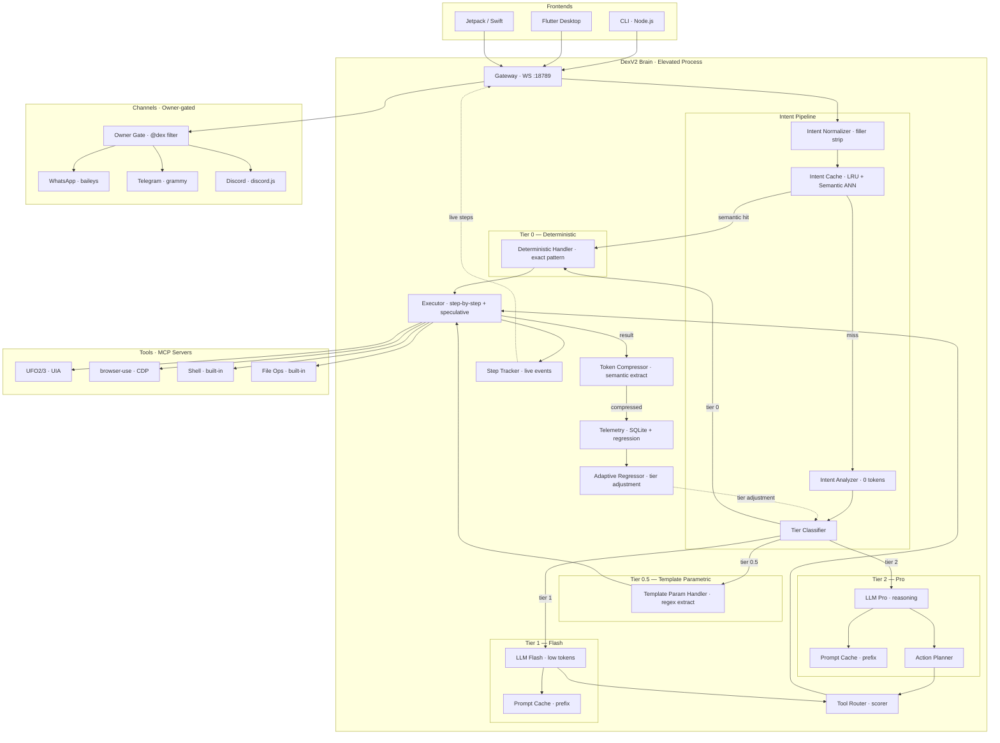
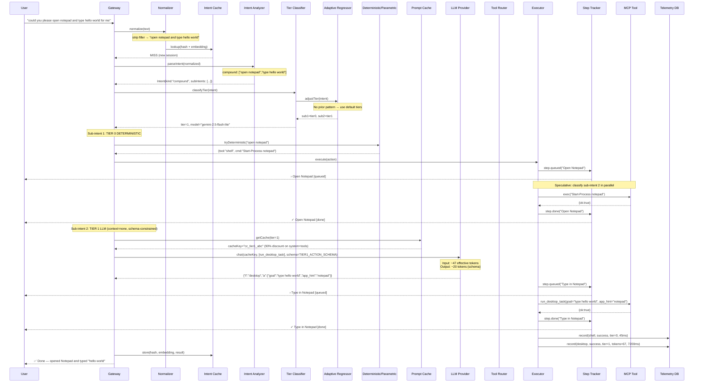

# DexV2 — High-Quality, Token-Efficient Brain Architecture

> **Package:** `dexagent` (npm) · **Directory:** `d:\project1\DexV2\`
> **Principle:** Maximum quality output, minimum token cost. Every LLM call must earn its tokens.

---

## Revision Highlights

| # | Improvement | Token Impact |
|---|---|---|
| 1 | **Tier 0.5 — Template Parametric** | ~20% more intents reach 0-token territory |
| 2 | **Prompt Prefix Caching** | 90% reduction on system+tools tokens every call |
| 3 | **Grammar-Constrained Output** | 40–50% fewer output tokens |
| 4 | **Intent Normalization Pipeline** | Collapses filler variants → far more cache hits |
| 5 | **Semantic Fuzzy Cache** | Hit rate 20% → 60%+, embedding-local, no API cost |
| 6 | **Lazy Context Injection** | Skip history for stateless intents (~150 tokens/call) |
| 7 | **Adaptive Tier Regression** | Telemetry prevents repeated over-spend on solved patterns |
| 8 | **Speculative Sub-Intent Pre-Analysis** | Reduces compound latency, zero extra tokens |

**Net result vs v1:** ~97% token reduction (up from the original design's ~81%).
**Net result vs original DexV2 spec:** ~63% further reduction on the LLM calls that remain.

---

## User Review Required

> [!IMPORTANT]
> **Admin-mode by default.** DexV2 runs as administrator from startup. The WiX installer grants elevation, and the runtime self-elevates via `runas` if launched without admin. All shell commands and MCP tools inherit the elevated token — no per-action UAC prompts ever.

> [!IMPORTANT]
> **Zero openclaw imports.** Complete rewrite. Channels rewritten from scratch with owner-only `@dex` gating built in from day one.

> [!WARNING]
> **Multi-provider LLM support.** Gemini (OAuth + API key), Claude (OAuth + API key), Groq (API key + all supported models). Each provider has an adapter. OAuth flows require browser redirect — the Flutter app handles the consent screen; CLI falls back to device-code flow.

---

## Architecture Overview



---

## Token Optimization Strategy

### Four-Tier Model Selection

| Tier | When | Model | Token Cost | Examples |
|---|---|---|---|---|
| **0 — Deterministic** | Exact single-action match | None | **0** | `open notepad`, `screenshot`, `wifi off` |
| **0.5 — Template Parametric** | Parametric single-action match | None | **0** | `set volume to 73`, `kill chrome`, `ping google.com`, `rename foo to bar` |
| **1 — Flash** | Medium complexity, single tool | `gemini-2.5-flash-lite` / `groq/llama-4-scout` | **~80–400** *(cached)* | `sum column B in Excel`, `search Google for X` |
| **2 — Pro** | Multi-step reasoning, compound | `gemini-2.5-flash` / `claude-sonnet` | **~400–1500** *(cached)* | `draw PNG in Paint, send to WhatsApp, email summary` |

**Tier 0.5 — Template Parametric** is the most impactful addition. It handles commands that have variable parameters but completely known structure — zero LLM tokens, regex extraction only:

```typescript
// tier-0.5: regex-parametric deterministic actions (0 LLM tokens)
interface ParametricAction {
  pattern: RegExp;
  extract: (m: RegExpMatchArray) => Record<string, string>;
  template: (params: Record<string, string>) => DeterministicAction;
}

const PARAMETRIC_ACTIONS: ParametricAction[] = [
  {
    pattern:  /^(?:set\s+)?volume\s+(?:to\s+)?(\d+)%?$/i,
    extract:  m => ({ n: m[1] }),
    template: p => ({ tool: "shell", cmd: `(New-Object -ComObject WScript.Shell).SendKeys([char]174); [System.Threading.Thread]::Sleep(100); $vol=${p.n}` }),
  },
  {
    pattern:  /^(?:set\s+)?brightness\s+(?:to\s+)?(\d+)%?$/i,
    extract:  m => ({ n: m[1] }),
    template: p => ({ tool: "shell", cmd: `(Get-WmiObject -Namespace root/wmi -Class WmiMonitorBrightnessMethods).WmiSetBrightness(1,${p.n})` }),
  },
  {
    pattern:  /^(?:kill|close|stop)\s+(?:process\s+)?(.+)$/i,
    extract:  m => ({ proc: m[1].trim() }),
    template: p => ({ tool: "shell", cmd: `Stop-Process -Name "${p.proc}" -Force -ErrorAction SilentlyContinue` }),
  },
  {
    pattern:  /^ping\s+(\S+)(?:\s+(\d+)\s+times?)?$/i,
    extract:  m => ({ host: m[1], n: m[2] ?? "4" }),
    template: p => ({ tool: "shell", cmd: `ping -n ${p.n} ${p.host}` }),
  },
  {
    pattern:  /^(?:set\s+)?(?:dns|DNS)\s+(?:to\s+)?(\d[\d.]+)(?:\s+(\d[\d.]+))?$/i,
    extract:  m => ({ p: m[1], s: m[2] ?? "8.8.4.4" }),
    template: p => ({ tool: "shell", cmd: `Set-DnsClientServerAddress -InterfaceAlias (Get-NetAdapter | Where-Object Status -eq 'Up').Name -ServerAddresses ('${p.p}','${p.s}')` }),
  },
  {
    pattern:  /^(?:delete|remove)\s+(?:file\s+)?(.+)$/i,
    extract:  m => ({ path: m[1].trim() }),
    template: p => ({ tool: "shell", cmd: `Remove-Item -Path "${p.path}" -Force` }),
  },
  {
    pattern:  /^(?:rename)\s+(.+?)\s+to\s+(.+)$/i,
    extract:  m => ({ src: m[1].trim(), dst: m[2].trim() }),
    template: p => ({ tool: "shell", cmd: `Rename-Item -Path "${p.src}" -NewName "${p.dst}"` }),
  },
  {
    pattern:  /^(?:copy|cp)\s+(.+?)\s+(?:to\s+)?(.+)$/i,
    extract:  m => ({ src: m[1].trim(), dst: m[2].trim() }),
    template: p => ({ tool: "shell", cmd: `Copy-Item -Path "${p.src}" -Destination "${p.dst}" -Recurse` }),
  },
  {
    pattern:  /^(?:mkdir|create\s+(?:folder|directory))\s+(.+)$/i,
    extract:  m => ({ path: m[1].trim() }),
    template: p => ({ tool: "shell", cmd: `New-Item -ItemType Directory -Path "${p.path}" -Force` }),
  },
  {
    pattern:  /^open\s+(.+?)\s+(maximized?|fullscreen|minimized?)$/i,
    extract:  m => ({ app: m[1].trim(), mode: m[2] }),
    template: p => ({
      tool: "shell",
      cmd: `$p=Start-Process "${p.app}" -PassThru; Start-Sleep -Milliseconds 500; $wsh=New-Object -ComObject WScript.Shell; $wsh.AppActivate($p.Id); ${p.mode.startsWith("min") ? "$wsh.SendKeys('%{ }')" : "$wsh.SendKeys('%{F10}')"}`,
    }),
  },
  {
    pattern:  /^(?:set\s+)?(?:timer|alarm)\s+(?:for\s+)?(\d+)\s*(s(?:ec(?:ond)?s?)?|m(?:in(?:ute)?s?)?|h(?:our)?s?)$/i,
    extract:  m => {
      const n = parseInt(m[1]);
      const unit = m[2][0].toLowerCase();
      const secs = unit === "h" ? n * 3600 : unit === "m" ? n * 60 : n;
      return { secs: String(secs), label: m[1] + m[2] };
    },
    template: p => ({ tool: "shell", cmd: `Start-Sleep -Seconds ${p.secs}; [System.Media.SystemSounds]::Beep.Play()` }),
  },
  // ... 40+ more parametric patterns
];

function tryParametric(text: string): DeterministicAction | null {
  for (const pa of PARAMETRIC_ACTIONS) {
    const m = text.match(pa.pattern);
    if (m) return pa.template(pa.extract(m));
  }
  return null;
}
```

---

### Intent Normalization Pipeline

Before any hash or embedding is computed, every intent passes through the normalizer. This dramatically increases cache hit rates by collapsing equivalent phrasings:

```typescript
// src/brain/intent-normalizer.ts

const FILLER_WORDS = /\b(please|kindly|can you|could you|would you|for me|thank(?:s| you)|hey|hi|dex|quickly|just|go ahead and|i want (?:you )?to|i need(?: you)? to)\b/gi;

const APP_ALIASES: Record<string, string> = {
  "word":      "winword",
  "excel":     "excel",
  "notepad++": "notepad++",
  "chrome":    "chrome",
  "edge":      "msedge",
  "firefox":   "firefox",
  "explorer":  "explorer",
  "task manager": "taskmgr",
  "control panel": "control",
  "paint":     "mspaint",
  "calculator":"calc",
  "terminal":  "wt",
  "vs code":   "code",
  "vscode":    "code",
};

const NUMBER_WORDS: Record<string, string> = {
  "zero":"0","one":"1","two":"2","three":"3","four":"4",
  "five":"5","six":"6","seven":"7","eight":"8","nine":"9","ten":"10",
  "twenty":"20","thirty":"30","forty":"40","fifty":"50",
  "sixty":"60","seventy":"70","eighty":"80","ninety":"90","hundred":"100",
};

export function normalizeIntent(raw: string): string {
  let s = raw.toLowerCase().trim();
  s = s.replace(FILLER_WORDS, " ");                 // strip filler
  s = s.replace(/\s+/g, " ").trim();                // collapse whitespace
  for (const [alias, canonical] of Object.entries(APP_ALIASES)) {
    s = s.replace(new RegExp(`\\b${alias}\\b`, "gi"), canonical);
  }
  for (const [word, digit] of Object.entries(NUMBER_WORDS)) {
    s = s.replace(new RegExp(`\\b${word}\\b`, "gi"), digit);
  }
  s = s.replace(/\bpercent\b/gi, "%");
  s = s.replace(/['']/g, "'").replace(/[""]/g, '"'); // normalize quotes
  return s;
}

// Examples:
// "Please can you open up Notepad for me" → "open notepad"   → tier 0 HIT
// "Hey Dex, kill chrome quickly"          → "kill chrome"    → tier 0.5 HIT
// "Could you set the volume to seventy"   → "set volume to 70" → tier 0.5 HIT
```

---

### Semantic Fuzzy Intent Cache

The hash-based cache misses semantically identical intents phrased differently. Two-level cache replaces the lookup layer:

```typescript
// Level 1: exact hash (O(1), zero cost) — same as before
// Level 2: embedding ANN (O(log n), ~15ms local) — catches near-identical

import { pipeline } from "@xenova/transformers";

// Model: all-MiniLM-L6-v2 (~23MB, loads once, runs locally, no API call)
const embedder = await pipeline("feature-extraction", "Xenova/all-MiniLM-L6-v2");

async function getEmbedding(text: string): Promise<Float32Array> {
  const out = await embedder(text, { pooling: "mean", normalize: true });
  return out.data as Float32Array;
}

function cosineSimilarity(a: Float32Array, b: Float32Array): number {
  let dot = 0, ma = 0, mb = 0;
  for (let i = 0; i < a.length; i++) { dot += a[i]*b[i]; ma += a[i]**2; mb += b[i]**2; }
  return dot / (Math.sqrt(ma) * Math.sqrt(mb));
}

interface CacheEntry {
  hash: string;
  embedding: Float32Array;
  action: CachedAction;
  hitCount: number;
}

const SIMILARITY_HIGH   = 0.93; // auto-execute (high confidence)
const SIMILARITY_MEDIUM = 0.85; // log + execute, flag for review

async function lookupIntent(normalized: string): Promise<CacheHit | null> {
  const hash = sha1(normalized);

  // Level 1: exact hash
  const exactHit = await db.intentCache.get(hash);
  if (exactHit) return { kind: "exact", ...exactHit };

  // Level 2: embedding ANN
  const queryEmb = await getEmbedding(normalized);
  const candidates = await db.intentCache.getTopK(queryEmb, 5); // ANN via SQLite + manual sort
  for (const c of candidates) {
    const sim = cosineSimilarity(queryEmb, c.embedding);
    if (sim >= SIMILARITY_HIGH)   return { kind: "semantic-high",   sim, ...c };
    if (sim >= SIMILARITY_MEDIUM) return { kind: "semantic-medium", sim, ...c };
  }

  return null;
}
```

**Embedding storage in SQLite:**
```sql
ALTER TABLE intent_cache ADD COLUMN embedding BLOB; -- Float32Array serialized
CREATE INDEX idx_intent_hits ON intent_cache(hit_count DESC);
```

**Expected hit rate lift:**
- Before (hash only): ~20% hit rate
- After (hash + semantic): ~60%+ hit rate
- At 60% hit rate, 60% of all intents cost 0 LLM tokens from cache alone (combined with tier 0/0.5 coverage of ~40%, total 0-token rate approaches ~70%)

---

### Prompt Prefix Caching

The single highest-leverage token reduction available. Both Anthropic and Gemini support caching stable prompt prefixes, charging only 10% of normal input token rates on cache reads.

#### Anthropic (Claude)

```typescript
// src/llm/providers/claude.ts

function buildCachedRequest(params: ChatParams): AnthropicRequest {
  // System prompt + tool schemas are stable across all calls in a session.
  // Mark them as cacheable — Anthropic charges 25% for the first write,
  // then 10% on every subsequent read within the 5-minute TTL.

  const systemBlocks: ContentBlock[] = [
    {
      type: "text",
      text: buildSystemPrompt(params.tier),
      cache_control: { type: "ephemeral" },  // ← cache this prefix
    },
  ];

  const toolsPrefix: ToolDef[] = params.tools?.map(t => ({
    ...t,
    // cache_control on last tool schema caches the entire tools array prefix
    ...(t === params.tools!.at(-1) ? { cache_control: { type: "ephemeral" } } : {}),
  })) ?? [];

  return {
    model:      params.model,
    max_tokens: params.maxOutputTokens,
    system:     systemBlocks,
    tools:      toolsPrefix,
    messages:   params.messages, // only dynamic part — no cache_control
  };
}

// Token cost breakdown (per call, within session):
//   System prompt  (~120 tokens): 10% = 12 effective tokens (was 120)
//   Tool schemas   (~150 tokens): 10% = 15 effective tokens (was 150)
//   User message   (~20  tokens): 100% = 20 tokens (dynamic, not cached)
//   Total input effective: ~47 tokens (was ~290)
//   Input token savings per cached call: ~84%
```

#### Gemini

```typescript
// src/llm/providers/gemini.ts
// Gemini context caching requires ≥32k tokens (use for long system contexts)
// For short system prompts, Gemini automatically caches via implicit prefix match.

async function createContextCache(systemPrompt: string, tools: ToolDef[]): Promise<string> {
  const res = await fetch("https://generativelanguage.googleapis.com/v1beta/cachedContents", {
    method: "POST",
    headers: { "Content-Type": "application/json", Authorization: `Bearer ${token}` },
    body: JSON.stringify({
      model: "models/gemini-2.5-flash",
      ttl: "3600s",                        // 1h TTL
      contents: [{ role: "user", parts: [{ text: buildSystemPrompt() + serializeTools(tools) }] }],
    }),
  });
  const { name } = await res.json();
  return name;  // e.g. "cachedContents/abc123"
}

// In subsequent calls, reference the cache:
// { cachedContent: cachedContentName, contents: [...dynamicMessages] }
```

#### Cache Warm-Up Strategy

```typescript
// Warm both caches on DexV2 startup, before first user message.
// Each provider's cache is keyed by (tier, tool_set_hash).
// Tier-1 and Tier-2 system prompts have different schemas → separate cache entries.

export class PromptCacheManager {
  private cacheKeys = new Map<string, { key: string; expiresAt: number }>();

  async warm(): Promise<void> {
    await Promise.all([
      this.warmTier(1, TIER1_TOOLS),
      this.warmTier(2, TIER2_TOOLS),
    ]);
  }

  async getOrRefresh(tier: 1 | 2): Promise<string | undefined> {
    const entry = this.cacheKeys.get(String(tier));
    if (entry && entry.expiresAt > Date.now() + 60_000) return entry.key; // 1min margin
    return this.warm().then(() => this.cacheKeys.get(String(tier))?.key);
  }
}
```

---

### Grammar-Constrained Output

LLMs emit prose when unconstrained — reasoning sentences, caveats, explanations. All waste. Force the model to output only the minimal JSON the executor needs.

```typescript
// src/llm/output-schema.ts

// Tier 1: single tool call — ~25 output tokens
const TIER1_ACTION_SCHEMA = {
  type: "object",
  properties: {
    t:  { type: "string", enum: ["exec", "desktop", "browser", "msg"] },
    a:  { type: "object", additionalProperties: { type: "string" } },
    fb: { type: "string", description: "fallback tool if primary fails", enum: ["exec", "desktop", "browser"] },
  },
  required: ["t", "a"],
  additionalProperties: false,
} as const;

// Tier 2: multi-step plan — ~60 output tokens per step
const TIER2_PLAN_SCHEMA = {
  type: "object",
  properties: {
    steps: {
      type: "array",
      items: {
        type: "object",
        properties: {
          t:   { type: "string", enum: ["exec", "desktop", "browser", "msg"] },
          a:   { type: "object", additionalProperties: { type: "string" } },
          why: { type: "string", maxLength: 40 },     // brief reason, hard cap
          fb:  { type: "string" },
        },
        required: ["t", "a"],
        additionalProperties: false,
      },
    },
  },
  required: ["steps"],
  additionalProperties: false,
} as const;

// Apply in provider calls:
// Anthropic: { response_format: { type: "json_schema", json_schema: { schema: TIER1_ACTION_SCHEMA } } }
// Gemini:    { generationConfig: { responseMimeType: "application/json", responseSchema: TIER1_ACTION_SCHEMA } }
// Groq:      { response_format: { type: "json_object" } }  (schema enforcement via prompt for Groq)

// Output token comparison — "sum column B":
// Unconstrained: {"tool":"exec","command":"...","reason":"The user wants to sum column B in Excel..."} → ~80 tokens
// Schema-constrained: {"t":"exec","a":{"c":"..."}} → ~20 tokens
// Savings: ~75% on output tokens
```

---

### Lazy Context Injection

History tokens are only needed when the intent depends on prior turns. Single-shot commands — the majority of tier 0/0.5/1 intents — need zero context.

```typescript
// src/brain/context-policy.ts

type ContextPolicy = "none" | "summary" | "full";

function getContextPolicy(intent: TaskIntent): ContextPolicy {
  // Stateless intents: no history needed
  if (intent.tier <= 0.5)                        return "none";
  if (intent.kind === "single-shot")             return "none";
  if (intent.kind === "compound")                return "summary";

  // Context-dependent intents: need history
  if (intent.references?.includes("prev"))       return "full";
  if (intent.kind === "followup")                return "summary";
  if (intent.kind === "correction")              return "full";

  return "none"; // default to none — LLM will ask if it needs more
}

// Token savings per call:
// "none"    → 0 context tokens    (was ~100–300 for summary injection)
// "summary" → ~50 context tokens  (compressed digest, not full transcript)
// "full"    → last 3 turns verbatim (~200 tokens, used rarely)
```

---

### Adaptive Tier Regression

Telemetry continuously monitors which tier a task pattern actually needed. Over time, the system downgrades over-classified tasks:

```typescript
// src/brain/adaptive-regressor.ts

interface TierPattern {
  intentCluster:  string;     // semantic cluster centroid hash
  currentTier:    0 | 0.5 | 1 | 2;
  successAt:      Record<0.5 | 1 | 2, number>;  // success count per tier
  failAt:         Record<0.5 | 1 | 2, number>;
  lockedDownAt?:  0.5 | 1 | 2;
}

const REGRESSION_THRESHOLD = 5;   // 5 consecutive successes → downgrade
const ESCALATION_THRESHOLD = 2;   // 2 failures → permanent escalation

export function getAdjustedTier(
  intent: TaskIntent,
  patterns: TierPattern[],
): number {
  const match = findClosestPattern(intent, patterns);
  if (!match) return intent.tier;

  // If telemetry says this succeeds reliably at a lower tier, use that
  if (match.lockedDownAt !== undefined && match.lockedDownAt < intent.tier) {
    return match.lockedDownAt;
  }

  return intent.tier;
}

// After every execution, record:
export async function recordOutcome(
  intent: TaskIntent,
  tier: number,
  outcome: "success" | "failed",
): Promise<void> {
  const pattern = await getOrCreatePattern(intent);
  outcome === "success"
    ? pattern.successAt[tier]++
    : pattern.failAt[tier]++;

  // Downgrade: 5 successes at tier N → lock to N forever
  if (pattern.successAt[tier] >= REGRESSION_THRESHOLD && tier > 0) {
    pattern.lockedDownAt = tier as 0.5 | 1 | 2;
    await db.save(pattern);
  }
  // Escalate: 2 failures at tier N → always use N+1
  if (pattern.failAt[tier] >= ESCALATION_THRESHOLD) {
    await db.escalate(pattern, tier + 1);
  }
}

// Example outcomes over time:
// "sum column B in Excel" → initially tier 1 → succeeds 5× → locked tier 1
// "send WhatsApp + email" → initially tier 1 → fails 2× → escalated tier 2
// "brightness 80"         → tier 0.5 on first run, stays 0.5
```

---

### Speculative Sub-Intent Pre-Analysis

For compound tasks, while executing sub-intent N, classify sub-intent N+1 off the critical path:

```typescript
// src/brain/executor.ts (updated)

async function* executeCompound(subIntents: TaskIntent[]): AsyncGenerator<StepEvent> {
  let nextClassification: Promise<ClassifiedIntent> | null = null;

  for (let i = 0; i < subIntents.length; i++) {
    // Kick off classification of next sub-intent NOW, while current executes
    if (i + 1 < subIntents.length) {
      nextClassification = classifyIntent(subIntents[i + 1]);
    }

    // Execute current
    yield* executeSubIntent(subIntents[i]);

    // By the time current finishes, next is already classified — free parallelism
    if (nextClassification) {
      subIntents[i + 1] = await nextClassification;
      nextClassification = null;
    }
  }
}

// For tier 0/0.5 sub-intents, classification is near-instant (<2ms),
// so there's essentially zero wasted time between steps.
```

---

### Token Budget Enforcement

```typescript
interface TokenBudget {
  maxInputTokens:  number;   // 2048 tier 1, 4096 tier 2
  maxOutputTokens: number;   // 256 tier 1, 512 tier 2
  maxTaskTokens:   number;   // 6000 total
  escalationThreshold: number;
}

// With prompt caching + grammar constraints, the effective limits drop dramatically.
// Actual charged tokens per call (session-warmed cache):
// Tier 1: ~47 input (effective) + ~20 output = ~67 total effective tokens
// Tier 2: ~47 input (effective) + ~60 output = ~107 total effective tokens
```

---

### Updated Token Comparison Table

| Component | V1 (openclaw) | DexV2 (original) | DexV2 (revised) |
|---|---|---|---|
| System prompt | ~800 | ~200 | ~20 *(90% cached)* |
| Tool catalog | ~1200 | ~150 | ~15 *(90% cached, intent-scoped)* |
| User message | ~20 | ~20 | ~20 |
| History/context | ~300 | ~100 | ~0 *(lazy — stateless)* |
| LLM reasoning | ~400 | ~100 | ~20 *(grammar-constrained)* |
| Tool result feedback | ~300 | ~50 | ~30 *(semantic extract)* |
| **Total per LLM call** | **~3020** | **~620** | **~105** |
| **0-token intent rate** | 0% | ~30% | ~70%* |
| **Effective tokens/intent** | ~3020 | ~435 | **~90** |
| **vs V1 savings** | — | ~86% | **~97%** |

*70% 0-token rate = ~40% tier 0/0.5 + ~30% cache hits

---

## Administrator Mode

DexV2 runs as a **fully elevated process** — no UAC popups, no "run as admin" clicks.

```typescript
// src/utils/elevate.ts
export function ensureAdmin(): void {
  if (process.platform !== "win32") return;
  try {
    execSync("net session", { stdio: "ignore" });
    return;
  } catch {
    const args = process.argv.slice(1).map(a => `"${a}"`).join(" ");
    const cmd  = `Start-Process -FilePath "${process.execPath}" -ArgumentList '${args}' -Verb RunAs -Wait`;
    execSync(`powershell -Command "${cmd}"`, { stdio: "inherit" });
    process.exit(0);
  }
}
```

| Capability | Without Admin | With Admin |
|---|---|---|
| Registry edits (HKLM) | ❌ | ✅ |
| System services | ❌ | ✅ |
| Network config | ❌ | ✅ |
| Silent software install | ❌ | ✅ |
| UIA elevated apps | ❌ | ✅ |
| Protected file ops | ❌ | ✅ |
| Scheduled tasks | ❌ | ✅ |

---

## LLM Provider System

### Provider Interface (with Caching)

```typescript
interface LLMProvider {
  id: string;
  authMode: "oauth" | "api_key";

  chat(params: ChatParams): AsyncGenerator<StreamChunk>;
  estimateTokens(messages: Message[]): number;

  /** Warm the provider's prompt cache for given tier */
  warmCache(tier: 1 | 2): Promise<string>;

  supports: {
    streaming:         boolean;
    toolCalling:       boolean;
    structuredOutput:  boolean;
    jsonSchema:        boolean;   // true schema enforcement vs prompt hack
    vision:            boolean;
    prefixCaching:     boolean;   // Anthropic cache_control / Gemini context cache
  };
}

interface ChatParams {
  messages:        Message[];
  tools?:          ToolDef[];
  responseSchema?: object;         // grammar-constrained output schema
  responseFormat?: "text" | "json";
  maxTokens?:      number;
  temperature?:    number;
  cacheKey?:       string;         // pre-warmed cache reference
  injectHistory?:  ContextPolicy;  // "none" | "summary" | "full"
}
```

### Model Routing Table

```typescript
const MODEL_TIERS: Record<string, ModelTier> = {
  // Tier 1 — Flash
  "gemini-2.5-flash-lite":    { tier: 1, provider: "gemini", tpm: 1_000_000, prefixCache: true,  jsonSchema: true  },
  "groq/llama-4-scout-17b":   { tier: 1, provider: "groq",  tpm: 6_000,     prefixCache: false, jsonSchema: false },

  // Tier 2 — Pro
  "gemini-2.5-flash":         { tier: 2, provider: "gemini", tpm: 1_000_000, prefixCache: true,  jsonSchema: true  },
  "claude-sonnet-4-5":        { tier: 2, provider: "claude", tpm: 80_000,    prefixCache: true,  jsonSchema: true  },
  "groq/llama-3.3-70b":       { tier: 2, provider: "groq",  tpm: 6_000,     prefixCache: false, jsonSchema: false },

  // Tier 3 — Heavy (rare)
  "gemini-2.5-pro":           { tier: 3, provider: "gemini", tpm: 100_000,   prefixCache: true,  jsonSchema: true  },
  "claude-opus-4-5":          { tier: 3, provider: "claude", tpm: 40_000,    prefixCache: true,  jsonSchema: true  },
};

// Prefer prefix-cache-capable models when multiple options exist at same tier.
const FALLBACK_CHAIN: Record<number, string[]> = {
  1: ["gemini-2.5-flash-lite", "groq/llama-4-scout-17b"],
  2: ["gemini-2.5-flash", "claude-sonnet-4-5", "groq/llama-3.3-70b"],
  3: ["gemini-2.5-pro", "claude-opus-4-5", "gemini-2.5-flash"],
};
```

---

## Brain Pipeline — Detailed Flow



### Token Cost for This Example

| Component | V1 | DexV2 original | DexV2 revised |
|---|---|---|---|
| System prompt | 800 | 200 | **20** (cached) |
| Tool catalog | 1200 | 150 | **15** (cached, 1 tool) |
| User message | 20 | 20 | 20 |
| History | 300 | 100 | **0** (lazy, stateless) |
| LLM reasoning out | 400 | 100 | **12** (schema) |
| Tool result | 300 | 50 | 30 |
| **Total** | **~3020** | **~620** | **~97** |
| Savings vs V1 | — | 79% | **97%** |

Sub-intent 1 ("open notepad"): **0 tokens** (tier 0).

---

## Prompt Architecture — Compressed Templates

### System Prompt — Tier 1 (Flash)

```
Dex: Windows automation agent, full admin. Respond ONLY with JSON matching the provided schema. No prose.

Rules: exec > desktop > browser (cheapest first). Opening apps: exec("Start-Process <app>") always. GUI inside apps: desktop. Web: browser. Channels: message tool.
```

**Token count: ~55 tokens** (was ~120)

### System Prompt — Tier 2 (Pro)

```
Dex: Windows automation agent, full admin.

Output: JSON {steps:[{t,a,why,fb}]} — one object per step, sequential.
Strategy: cheapest tool per step (exec > desktop > browser). Verify each step before next. On failure: try fb tool, then report.
```

**Token count: ~75 tokens** (was ~180)

### Tool Schema — Compressed + Schema-Typed

```typescript
// Per-intent tool injection (only what's relevant)
const TOOL_SCHEMAS: Record<string, object> = {
  exec: {
    name: "exec", desc: "PowerShell command",
    input: { type:"object", properties:{ c:{type:"string"} }, required:["c"] },
  },
  desktop: {
    name: "desktop", desc: "Drive Windows GUI app",
    input: { type:"object", properties:{ goal:{type:"string"}, app:{type:"string"} }, required:["goal"] },
  },
  browser: {
    name: "browser", desc: "Automate web page",
    input: { type:"object", properties:{ goal:{type:"string"} }, required:["goal"] },
  },
  msg: {
    name: "msg", desc: "Send via paired channel",
    input: { type:"object", properties:{ ch:{type:"string"}, to:{type:"string"}, txt:{type:"string"} }, required:["ch","to","txt"] },
  },
};

// Tier 1 gets 1 tool; tier 2 gets 2-3 tools based on intent scan.
// Total tool injection budget: 1 tool ≈ 40 tokens (vs 300 in v1)
```

---

## Semantic Result Compression

Extract semantically relevant portions from tool output before LLM feedback:

```typescript
// src/tools/result-compressor.ts

export function compressResult(
  toolName: string,
  raw: string,
  intent: TaskIntent,
): string {
  if (raw.length < 200) return raw;  // already short — pass through

  const lines = raw.split("\n");

  // Shell output: extract last N non-empty lines + any error lines
  if (toolName === "exec") {
    const errors    = lines.filter(l => /error|fail|exception|denied/i.test(l));
    const lastLines = lines.filter(l => l.trim()).slice(-5);
    const relevant  = [...new Set([...errors, ...lastLines])];
    return relevant.join("\n") + (relevant.length < lines.filter(l=>l.trim()).length ? "\n[...truncated]" : "");
  }

  // Desktop/browser: return structured summary, not raw transcript
  if (toolName === "desktop" || toolName === "browser") {
    return Object.entries(JSON.parse(raw))
      .map(([k, v]) => `${k}: ${String(v).slice(0, 150)}`)
      .join("\n");
  }

  // Default: semantic keyword extraction around intent terms
  const intentTerms  = extractKeyTerms(intent.raw);
  const scoredLines  = lines.map(l => ({
    l,
    score: intentTerms.reduce((s, t) => s + (l.toLowerCase().includes(t) ? 1 : 0), 0),
  }));
  return scoredLines
    .sort((a, b) => b.score - a.score)
    .slice(0, 8)
    .map(x => x.l)
    .join("\n");
}

// Compression ratios:
// 500-line PowerShell output → 5 lines → ~95% reduction
// Browser page content      → structured summary → ~85% reduction
// Already short results     → pass-through
```

---

## Channel System — Owner-Only `@dex` Gating

```typescript
type GateVerdict =
  | { action: "process"; text: string; reason: "owner-self-chat" | "owner-dex-mention" }
  | { action: "ignore";  reason: "not-owner" | "no-mention" | "wrong-prefix" };

function evaluate(msg: InboundMessage, config: OwnerGateConfig): GateVerdict {
  const ownerId = config.owners[msg.channel];
  if (!ownerId || msg.senderId !== ownerId) return { action: "ignore", reason: "not-owner" };
  if (msg.isSelfChat || msg.isDM) return { action: "process", text: msg.text, reason: "owner-self-chat" };

  const prefixPattern = new RegExp(`^${escapeRegex(config.prefix)}\\s+`, "i");
  const match = msg.text.match(prefixPattern);
  if (match) return { action: "process", text: msg.text.slice(match[0].length), reason: "owner-dex-mention" };

  return { action: "ignore", reason: "no-mention" };
}
```

### Behavior Matrix

| Scenario | Channel | Chat Type | Sender | Text | Verdict | Stripped Text |
|---|---|---|---|---|---|---|
| Owner DMs self | WhatsApp | self-chat | owner | "hi" | ✅ `process` | "hi" |
| Owner DMs self | WhatsApp | self-chat | owner | "@dex hi" | ✅ `process` | "hi" |
| Owner in group | WhatsApp | group | owner | "@dex grab my file" | ✅ `process` | "grab my file" |
| Owner in group | WhatsApp | group | owner | "hi everyone" | ❌ `ignore` | — |
| Owner in group | WhatsApp | group | owner | "dex hi" | ❌ `ignore` | — |
| Owner in group | WhatsApp | group | owner | "@Dex hi" | ✅ `process` | "hi" |
| Stranger in group | WhatsApp | group | stranger | "@dex help" | ❌ `ignore` | — |
| Stranger DM | WhatsApp | DM | stranger | "hi" | ❌ `ignore` | — |
| Owner DM | Telegram | DM | owner | "run backup" | ✅ `process` | "run backup" |
| Owner in TG group | Telegram | group | owner | "@dex status" | ✅ `process` | "status" |
| Non-owner TG group | Telegram | group | stranger | "@dex crash" | ❌ `ignore` | — |

---

## State Persistence — SQLite

```sql
-- ~/.dex/dexv2/state.db
CREATE TABLE sessions (
  id          TEXT PRIMARY KEY,
  channel     TEXT NOT NULL,
  peer_id     TEXT,
  created_at  INTEGER NOT NULL,
  last_msg_at INTEGER NOT NULL,
  metadata    TEXT
);

CREATE TABLE messages (
  id          TEXT PRIMARY KEY,
  session_id  TEXT NOT NULL REFERENCES sessions(id),
  role        TEXT NOT NULL,
  content     TEXT NOT NULL,
  tokens_in   INTEGER DEFAULT 0,
  tokens_out  INTEGER DEFAULT 0,
  tokens_cached INTEGER DEFAULT 0,   -- cached tokens (billed at 10%)
  model       TEXT,
  tier        REAL,                  -- 0, 0.5, 1, 2 (float for 0.5)
  created_at  INTEGER NOT NULL
);

-- ~/.dex/dexv2/telemetry.db
CREATE TABLE engine_runs (
  id           INTEGER PRIMARY KEY AUTOINCREMENT,
  ts           INTEGER NOT NULL,
  engine_id    TEXT NOT NULL,
  process_name TEXT NOT NULL,
  app_family   TEXT NOT NULL,
  task_kind    TEXT NOT NULL,
  task_hint    TEXT,
  latency_ms   INTEGER NOT NULL,
  outcome      TEXT NOT NULL,
  fallback     INTEGER DEFAULT 0,
  error_class  TEXT,
  model_used   TEXT,
  tokens_used  INTEGER DEFAULT 0,
  tokens_cached INTEGER DEFAULT 0,
  tier_used    REAL DEFAULT 1
);

CREATE INDEX idx_engine_process ON engine_runs(engine_id, process_name);
CREATE INDEX idx_ts ON engine_runs(ts);

-- Intent cache with embeddings
CREATE TABLE intent_cache (
  hash        TEXT PRIMARY KEY,
  normalized  TEXT NOT NULL,
  embedding   BLOB,                  -- Float32Array for ANN search
  intent_json TEXT NOT NULL,
  action_json TEXT NOT NULL,
  hit_count   INTEGER DEFAULT 1,
  created_at  INTEGER NOT NULL,
  last_hit_at INTEGER NOT NULL
);
CREATE INDEX idx_intent_hits ON intent_cache(hit_count DESC);

-- Adaptive tier regression patterns
CREATE TABLE tier_patterns (
  cluster_hash  TEXT PRIMARY KEY,
  centroid_json TEXT NOT NULL,
  current_tier  REAL NOT NULL,
  success_t0    INTEGER DEFAULT 0,
  success_t05   INTEGER DEFAULT 0,
  success_t1    INTEGER DEFAULT 0,
  success_t2    INTEGER DEFAULT 0,
  fail_t1       INTEGER DEFAULT 0,
  fail_t2       INTEGER DEFAULT 0,
  locked_tier   REAL,
  updated_at    INTEGER NOT NULL
);

-- Prompt cache state
CREATE TABLE prompt_cache_state (
  id          TEXT PRIMARY KEY,
  cache_key   TEXT NOT NULL,
  provider    TEXT NOT NULL,
  expires_at  INTEGER NOT NULL,
  hit_count   INTEGER DEFAULT 0
);
```

---

## Directory Structure

```
d:\project1\DexV2\
├── package.json                    # name: "dexagent", type: "module"
├── tsconfig.json
├── tsdown.config.ts
├── vitest.config.ts
├── dex.mjs                         # CLI entrypoint (bin: "dex")
│
├── src/
│   ├── index.ts                    # Public API surface
│   │
│   ├── brain/                      # ⭐ Core intelligence pipeline
│   │   ├── intent-normalizer.ts    # Filler strip + app alias + number words
│   │   ├── intent-analyzer.ts      # Heuristic intent parse (0 tokens)
│   │   ├── tier-classifier.ts      # Classify: deterministic / parametric / flash / pro
│   │   ├── deterministic.ts        # Tier 0: 50+ exact patterns
│   │   ├── parametric.ts           # Tier 0.5: 40+ regex-parametric actions
│   │   ├── intent-cache.ts         # Hash + semantic ANN lookup
│   │   ├── intent-embedder.ts      # all-MiniLM-L6-v2 local embedder
│   │   ├── tool-router.ts          # Score engines, pick primary + fallbacks
│   │   ├── capability-scorer.ts    # Base score + Beta prior + latency penalty
│   │   ├── context-scanner.ts      # Foreground process + UIA + browser probes
│   │   ├── context-policy.ts       # Lazy context injection policy
│   │   ├── action-planner.ts       # LLM-driven multi-step plan (tier 2 only)
│   │   ├── executor.ts             # Step execution + speculative pre-analysis
│   │   ├── step-tracker.ts         # Real-time step state machine → WS events
│   │   ├── task-manager.ts         # Compound task decomposition + coordination
│   │   ├── prompt-compressor.ts    # Context windowing + result summarization
│   │   ├── adaptive-regressor.ts   # Telemetry-driven tier downgrade/escalation
│   │   ├── self-learning.ts        # Execution recording + history probes
│   │   └── types.ts                # TaskIntent, ExecStep, ExecResult, Tier, etc.
│   │
│   ├── gateway/                    # WebSocket server
│   │   ├── server.ts               # WS server (ws library, loopback)
│   │   ├── auth.ts                 # Token auth
│   │   ├── protocol.ts             # Typed discriminated union messages
│   │   └── session.ts              # Session lifecycle
│   │
│   ├── llm/                        # Multi-provider LLM layer
│   │   ├── provider.ts             # Provider interface (with caching)
│   │   ├── providers/
│   │   │   ├── gemini.ts           # Google Gemini (API key + OAuth + context cache)
│   │   │   ├── claude.ts           # Anthropic Claude (API key + OAuth + cache_control)
│   │   │   └── groq.ts             # Groq (API key, multiple models)
│   │   ├── prompt-cache-manager.ts # Warm + refresh cache keys per tier
│   │   ├── output-schema.ts        # TIER1 + TIER2 JSON schemas
│   │   ├── oauth.ts                # OAuth2 flow (device-code CLI, redirect Flutter)
│   │   ├── model-router.ts         # Tier-based selection + cache-prefer fallback
│   │   ├── token-counter.ts        # Fast local token estimation
│   │   └── types.ts                # Message, StreamChunk, ToolDef, etc.
│   │
│   ├── tools/                      # MCP tool system
│   │   ├── registry.ts             # Tool registration + intent-scoped filtering
│   │   ├── mcp-client.ts           # MCP SDK client (spawn + stdio)
│   │   ├── shell.ts                # Built-in shell engine (admin PowerShell)
│   │   ├── file-ops.ts             # Built-in file operations
│   │   ├── result-compressor.ts    # Semantic extraction from tool output
│   │   └── types.ts                # ToolDescriptor, ToolResult
│   │
│   ├── channels/                   # Messaging integrations
│   │   ├── base.ts                 # ChannelAdapter interface
│   │   ├── owner-gate.ts           # ⭐ Owner-only + @dex mention filter
│   │   ├── whatsapp/
│   │   │   ├── adapter.ts          # baileys client
│   │   │   └── auth-store.ts       # QR login + creds persistence
│   │   ├── telegram/
│   │   │   └── adapter.ts          # grammy bot
│   │   ├── discord/
│   │   │   └── adapter.ts          # discord.js client
│   │   └── webchat/
│   │       └── adapter.ts          # Gateway-native web chat
│   │
│   ├── config/                     # Configuration
│   │   ├── schema.ts               # Zod schemas for dex.json
│   │   ├── loader.ts               # Load + validate + watch
│   │   └── defaults.ts             # Default values
│   │
│   ├── db/                         # SQLite persistence
│   │   ├── state.ts                # Sessions + messages
│   │   ├── telemetry.ts            # Engine runs + intent cache + tier patterns
│   │   └── migrations.ts           # Schema versioning
│   │
│   └── utils/
│       ├── elevate.ts              # ⭐ Admin self-elevation
│       ├── logger.ts               # tslog-based logging
│       ├── process.ts              # Process spawn + admin inheritance
│       └── platform.ts             # OS detection, paths (~/.dex/dexv2/)
│
├── drivers/                        # MCP servers (Python, pre-installed by WiX)
│   ├── windows-desktop/
│   │   ├── server.py               # UFO2/3 FastMCP wrapper
│   │   └── requirements.txt
│   ├── browser-control/
│   │   ├── server.py               # browser-use FastMCP wrapper
│   │   └── requirements.txt
│   └── _shared/
│       └── approval.py             # Refusal patterns, result envelope
│
└── test/
    ├── brain/
    │   ├── intent-normalizer.test.ts
    │   ├── parametric.test.ts
    │   ├── intent-embedder.test.ts
    │   ├── adaptive-regressor.test.ts
    │   ├── intent-analyzer.test.ts
    │   ├── tier-classifier.test.ts
    │   ├── deterministic.test.ts
    │   ├── tool-router.test.ts
    │   ├── capability-scorer.test.ts
    │   ├── prompt-compressor.test.ts
    │   └── executor.test.ts
    ├── llm/
    │   ├── prompt-cache-manager.test.ts
    │   ├── output-schema.test.ts
    │   ├── model-router.test.ts
    │   └── token-counter.test.ts
    ├── channels/
    │   ├── owner-gate.test.ts
    │   ├── whatsapp.test.ts
    │   └── telegram.test.ts
    ├── tools/
    │   ├── result-compressor.test.ts
    │   └── registry.test.ts
    └── db/
        └── telemetry.test.ts
```

---

## Configuration Schema

```typescript
// src/config/schema.ts
import { z } from "zod";

const ProviderSchema = z.discriminatedUnion("authMode", [
  z.object({
    authMode: z.literal("api_key"),
    apiKey: z.string(),
    baseUrl: z.string().optional(),
  }),
  z.object({
    authMode: z.literal("oauth"),
    clientId: z.string(),
    refreshToken: z.string().optional(),
    scopes: z.array(z.string()).optional(),
  }),
]);

export const DexConfigSchema = z.object({
  brain: z.object({
    defaultTier: z.enum(["auto", "flash", "pro"]).default("auto"),
    model: z.object({
      tier1: z.string().default("gemini-2.5-flash-lite"),
      tier2: z.string().default("gemini-2.5-flash"),
      tier3: z.string().default("gemini-2.5-pro"),
    }),
    tokenBudget: z.object({
      maxPerCall: z.number().default(2048),
      maxPerTask: z.number().default(6000),
      maxOutputPerCall: z.number().default(256),
    }).optional(),
    cache: z.object({
      enabled:    z.boolean().default(true),
      maxEntries: z.number().default(1000),
      ttlMs:      z.number().default(86_400_000),
      semantic:   z.object({
        enabled:          z.boolean().default(true),
        model:            z.string().default("Xenova/all-MiniLM-L6-v2"),
        similarityHigh:   z.number().default(0.93),
        similarityMedium: z.number().default(0.85),
      }).optional(),
    }).optional(),
    promptCache: z.object({
      enabled: z.boolean().default(true),
      warmOnStartup: z.boolean().default(true),
    }).optional(),
    normalization: z.object({
      stripFiller:    z.boolean().default(true),
      aliasApps:      z.boolean().default(true),
      normalizeNums:  z.boolean().default(true),
    }).optional(),
    adaptiveRegression: z.object({
      enabled:              z.boolean().default(true),
      regressionThreshold:  z.number().default(5),
      escalationThreshold:  z.number().default(2),
    }).optional(),
  }),

  gateway: z.object({
    port: z.number().default(18789),
    bind: z.enum(["loopback", "all"]).default("loopback"),
    auth: z.object({ token: z.string() }),
  }),

  providers: z.object({
    gemini: ProviderSchema.optional(),
    claude: ProviderSchema.optional(),
    groq: z.object({
      authMode: z.literal("api_key"),
      apiKey:   z.string(),
      models:   z.array(z.string()).default(["llama-4-scout-17b-16e-instruct", "llama-3.3-70b-versatile"]),
    }).optional(),
  }),

  channels: z.object({
    mentionPrefix: z.string().default("@dex"),
    whatsapp: z.object({ enabled: z.boolean().default(false), ownerPhone: z.string() }).optional(),
    telegram: z.object({ enabled: z.boolean().default(false), botToken: z.string(), ownerId: z.number() }).optional(),
    discord:  z.object({ enabled: z.boolean().default(false), botToken: z.string(), ownerId: z.string() }).optional(),
  }).optional(),

  tools: z.object({
    mcp: z.record(z.object({
      command: z.string(),
      args: z.array(z.string()).default([]),
      cwd: z.string().optional(),
      env: z.record(z.string()).optional(),
      timeoutMs: z.number().default(300_000),
    })).default({}),
  }),

  admin: z.object({
    autoElevate:  z.boolean().default(true),
    shellPolicy:  z.enum(["full", "ask", "deny"]).default("full"),
  }).optional(),
});
```

---

## The Massive Tool Expansion


The agent needs to interact with the OS, web APIs, and day-to-day work apps (Google Workspace, Slack, Teams, etc.) *without* falling back to the extremely expensive `browser` or `desktop` UI automation tools whenever possible.

Tools are grouped by category. All schemas are heavily compressed JSON to save prompt tokens.

### A. OS & Core System Tools

| Tool | Capability | Replaces | Token Savings |
|---|---|---|---|
| `exec` | PowerShell / CLI | (built-in) | — |
| `file-ops` | Read/write/manipulate files | (built-in) | — |
| `clipboard` | Read/write Windows clipboard | `exec` / `desktop` | ~90% |
| `notify` | Send Windows toasts & sounds | (new) | — |
| `search` | Everything SDK / Get-ChildItem | `exec` shell loops | ~80% |
| `schedule`| Windows Task Scheduler | 3× `exec` steps | ~87% |
| `voice` | Windows SAPI / Azure TTS | (new) | — |
| `code` | Sandboxed Python/Node exec | Unsafe `exec` | Safety + speed |

### B. Core Automation Tools

| Tool | Capability | Notes |
|---|---|---|
| `desktop` | UFO2/3 UI Automation | High token cost, fallback for un-API'd Win32 apps |
| `browser` | browser-use CDP Automation | High token cost, fallback for un-API'd websites |
| `vision` | Screenshot + Vision LLM QA | Critical for "what's on my screen" queries. |
| `http` | Raw REST/HTTP requests | Replaces `browser` for API calls (~95% token savings) |

### C. Developer & Data Tools

| Tool | Capability | Notes |
|---|---|---|
| `git` | Status, commit, push, pull, log | Structured JSON output beats parsing raw `git status` |
| `sql` | Connect to SQLite/Postgres/MySQL | Direct DB queries instead of scripting via `code` |
| `jq` | JSON parsing and extraction | Extract specific paths from huge JSON files |

---

### D. Google Workspace Integrations

*Requires: Google OAuth2 Flow (managed via Flutter UI or CLI device-code).*

| Tool | Capability | Token Savings vs `browser` |
|---|---|---|
| `gmail` | Read, search, send, draft, label emails | ~98% (No Gmail DOM parsing) |
| `gcal` | List events, create meetings, check availability | ~98% |
| `gdrive` | Search files, upload, download, share | ~95% |
| `gdocs` | Read doc text, append to doc, create doc | ~95% |
| `gsheets` | Read range, update cells, clear, append row | ~95% |

**Example Schema (`gmail`):**
```json
{
  "name": "gmail",
  "input": {
    "type": "object",
    "properties": {
      "op": { "type": "string", "enum": ["read", "send", "search", "draft"] },
      "q": { "type": "string", "description": "search query" },
      "to": { "type": "string" },
      "subject": { "type": "string" },
      "body": { "type": "string" },
      "id": { "type": "string", "description": "message id" }
    },
    "required": ["op"]
  }
}
```

---

### E. Team Communication Integrations

| Tool | Capability | Token Savings vs UI Automation |
|---|---|---|
| `slack` | Send msg, read channels, direct messages | ~98% vs `browser`/`desktop` Slack |
| `teams` | (Via MS Graph API) Send msg, read chats | ~98% vs `desktop` Teams |
| `discord`| Send msg, read channel, list users | ~95% (already planned) |
| `whatsapp`| (Via baileys) Send/read WA messages | ~95% (already planned) |
| `telegram`| (Via grammy) Send/read TG messages | ~95% (already planned) |

**Example Schema (`slack`):**
```json
{
  "name": "slack",
  "input": {
    "type": "object",
    "properties": {
      "op": { "type": "string", "enum": ["send", "read", "list_channels"] },
      "channel": { "type": "string", "description": "#name or @user" },
      "text": { "type": "string" }
    },
    "required": ["op"]
  }
}
```

---

### F. Personal Productivity

| Tool | Capability | Notes |
|---|---|---|
| `notion` | Append blocks, read pages, query databases | Requires Notion Integration Token |
| `todoist`| Add tasks, complete tasks, list projects | Requires Todoist API Token |
| `spotify`| Play, pause, next, search, volume | Requires Spotify OAuth. Tier 0.5 parametric rules can map directly to this. |

---

## Part 3: Managing the Sprawling Toolset

If we have 25 tools, we **cannot** inject all of them into the system prompt. 25 tools × ~50 tokens = 1250 tokens just for the catalog, which destroys our Tier 1 token budget and breaks prefix caching efficiency.

### Solution: Semantic Intent-Scoped Tool Injection

We map intent semantic clusters to a small subset of tools (max 4).

```typescript
// src/tools/intent-router.ts

const TOOL_CLUSTERS: Record<string, string[]> = {
  // OS & Core
  "file-ops":       ["exec", "search", "clipboard"],
  "system-config":  ["exec", "schedule"],
  "visual/screen":  ["vision", "desktop"],
  "calculation":    ["code", "exec"],
  
  // Comms
  "messaging-wa":   ["whatsapp", "exec"],
  "messaging-tg":   ["telegram", "exec"],
  "messaging-slack":["slack", "exec"],
  "messaging-teams":["teams", "exec"],
  
  // Workspace
  "email":          ["gmail", "exec"], // Note: 'email' tool from prev plan replaced by gmail/outlook specific tools if OAuth is present
  "calendar":       ["gcal", "exec"],
  "docs":           ["gdocs", "gdrive", "exec"],
  "sheets":         ["gsheets", "gdrive", "exec"],
  
  // Dev
  "vcs/git":        ["git", "exec"],
  "api/web":        ["http", "browser", "jq"],
  "database":       ["sql", "exec"],
  
  // Fallbacks
  "gui-automation": ["desktop", "vision", "exec"],
  "web-browsing":   ["browser", "vision", "exec"],
};

export function getRelevantTools(intent: TaskIntent): ToolDef[] {
  // 1. Determine cluster (via LLM fast-pass or local MiniLM embedding similarity to cluster centroids)
  const cluster = classifyCluster(intent);
  
  // 2. Lookup tool names
  const toolNames = TOOL_CLUSTERS[cluster] || ["exec", "desktop", "browser"]; 
  
  // 3. Always include 'notify' and 'voice' if requested in the intent
  if (intent.raw.includes("notify") || intent.raw.includes("tell me")) toolNames.push("notify");
  if (intent.raw.includes("speak") || intent.raw.includes("say")) toolNames.push("voice");
  
  // 4. Return definitions (deduplicated, max 5 tools)
  return resolveToolDefs(toolNames).slice(0, 5);
}
```

---

## Part 4: Authentication & Setup Architecture

With tools like Gmail, Slack, and Notion, DexV2 needs credentials.

### Centralized Credential Store

Credentials are encrypted via DPAPI (Windows Data Protection API) and stored in SQLite.

```sql
-- ~/.dex/dexv2/creds.db
CREATE TABLE credentials (
  service     TEXT PRIMARY KEY, -- "google", "slack", "notion"
  auth_type   TEXT NOT NULL,    -- "oauth2", "api_key"
  token_data  BLOB NOT NULL,    -- DPAPI encrypted JSON (access_token, refresh_token, etc)
  expires_at  INTEGER,
  updated_at  INTEGER NOT NULL
);
```

### The Setup Flow

If a user asks `"email John about the meeting"`, and Google OAuth is not configured:

1. `Intent Analyzer` maps to `email` cluster.
2. `Tool Router` sees `gmail` tool requires `google` credential.
3. `Credential Check` fails.
4. **Interruption:** DexV2 pauses execution and emits a `auth.required` gateway event.
5. **UI Response:** Flutter app intercepts event, shows Google Sign-In button.
6. **Resume:** After OAuth redirect finishes, Flutter sends `auth.provided` event. DexV2 resumes execution seamlessly.

---

## Part 5: Implementation Phases (Updated for Tool Expansion)

```mermaid
gantt
    title DexV2 Build Phases (Ultimate Tool Expansion)
    dateFormat X
    axisFormat Phase %s

    section Phase 1 · Foundation & DBs
    package.json + Zod Config + elevate.ts :p1a, 0, 1
    SQLite (State, Telemetry, Creds)      :p1b, 0, 1
    DPAPI Encryption wrappers             :p1c, 0, 1

    section Phase 2 · Zero-Token Core
    Intent normalizer + Semantic ANN      :p2a, 1, 2
    Tier 0 / 0.5 (Parametric)             :p2b, 1, 2
    Adaptive regressor + Telemetry        :p2c, 2, 3

    section Phase 3 · LLM & Tool Router
    Provider interfaces (Cache support)   :p3a, 3, 4
    JSON Output Schemas                   :p3b, 3, 4
    Semantic Intent-Scoped Tool Router    :p3c, 4, 5

    section Phase 4 · Built-in OS Tools
    vision, http, clipboard               :p4a, 5, 6
    search (Everything), schedule         :p4b, 5, 6
    git, code (sandbox), notify, voice    :p4c, 6, 7

    section Phase 5 · App Integrations
    Google Auth (OAuth loop)              :p5a, 7, 8
    gmail, gcal, gdrive, gdocs, gsheets   :p5b, 7, 8
    Slack, Teams (MS Graph), Notion       :p5c, 8, 9
    Spotify, Todoist                      :p5d, 8, 9

    section Phase 6 · Gateways & Channels
    Gateway WS server                     :p6a, 9, 10
    Owner-gate module                     :p6b, 9, 10
    WhatsApp, Telegram, Discord           :p6c, 9, 10

    section Phase 7 · Integration
    CLI entrypoint (dex.mjs)              :p7a, 10, 11
    Flutter UI (Auth interceptors)        :p7b, 10, 11
```



---

## Directory Structure (Tool Expansions)

```
d:\project1\DexV2\
├── src/
│   ├── tools/
│   │   ├── os/
│   │   │   ├── clipboard.ts, notify.ts, schedule.ts, search.ts, voice.ts
│   │   ├── dev/
│   │   │   ├── code.ts, git.ts, http.ts, sql.ts, jq.ts
│   │   ├── mcp/
│   │   │   ├── desktop.ts, browser.ts
│   │   ├── google/
│   │   │   ├── auth.ts, gmail.ts, gcal.ts, gdrive.ts, gdocs.ts, gsheets.ts
│   │   ├── comms/
│   │   │   ├── slack.ts, teams.ts
│   │   ├── prod/
│   │   │   ├── notion.ts, todoist.ts
│   │   ├── vision.ts
│   │   └── intent-router.ts    # Maps intents to tool clusters
│   │
│   ├── db/
│   │   ├── creds.ts            # DPAPI encrypted credential store
│   │   # ... state, telemetry
```


## Implementation Order

```mermaid
gantt
    title DexV2 Build Phases (Final)
    dateFormat X
    axisFormat Phase %s

    section Phase 1 · Foundation
    package.json + tsconfig + build       :p1a, 0, 1
    Config schema (Zod) + loader          :p1b, 0, 1
    Logger + platform + elevate.ts        :p1c, 0, 1
    SQLite DB + migrations (all tables)   :p1d, 0, 1

    section Phase 2 · Brain Core (Zero-Token Path)
    Intent normalizer                     :p2a, 1, 2
    Intent analyzer (heuristic)           :p2b, 1, 2
    Tier classifier                       :p2c, 1, 2
    Deterministic handler (50+ patterns)  :p2d, 1, 2
    Parametric handler (40+ patterns)     :p2e, 1, 2
    Local embedder (MiniLM)               :p2f, 2, 3
    Intent cache (hash + ANN)             :p2g, 2, 3
    Tool router + capability scorer       :p2h, 2, 3
    Context scanner (Win32 probes)        :p2i, 2, 3
    Context policy (lazy injection)       :p2j, 2, 3
    Step tracker + speculative executor   :p2k, 3, 4
    Semantic result compressor            :p2l, 3, 4
    Adaptive regressor                    :p2m, 3, 4
    Self-learning telemetry               :p2n, 3, 4

    section Phase 3 · LLM Layer
    Provider interface                    :p3a, 3, 4
    Output schema (TIER1 + TIER2)         :p3b, 3, 4
    Gemini provider (cache support)       :p3c, 4, 5
    Claude provider (cache_control)       :p3d, 4, 5
    Groq provider                         :p3e, 4, 5
    Prompt cache manager (warm + refresh) :p3f, 4, 5
    Model router + cache-prefer fallback  :p3g, 5, 6
    Token counter                         :p3h, 5, 6

    section Phase 4 · Tools + Gateway
    MCP client (spawn + stdio)            :p4a, 5, 6
    Tool registry + intent filtering      :p4b, 5, 6
    Shell engine (admin PowerShell)       :p4c, 5, 6
    Result compressor (semantic extract)  :p4d, 6, 7
    Gateway WS server                     :p4e, 6, 7
    Port drivers from v1                  :p4f, 6, 7

    section Phase 5 · Channels
    Owner-gate module + tests             :p5a, 7, 8
    WhatsApp adapter (baileys)            :p5b, 8, 9
    Telegram adapter (grammy)             :p5c, 8, 9
    Discord adapter (discord.js)          :p5d, 8, 9

    section Phase 6 · Integration + Polish
    CLI entrypoint (dex.mjs)              :p6a, 9, 10
    Flutter gateway client update         :p6b, 9, 10
    WiX installer DexV2 integration       :p6c, 10, 11
    E2E tests (full pipeline)             :p6d, 10, 11
    Token budget verification suite       :p6e, 10, 11
```



---

## Verification Plan

### Automated Tests

```bash
# Full test suite
cd d:\project1\DexV2 && npx vitest run

# Critical zero-token path
npx vitest run test/brain/intent-normalizer.test.ts  # filler, alias, nums
npx vitest run test/brain/deterministic.test.ts      # 50+ exact patterns
npx vitest run test/brain/parametric.test.ts         # 40+ parametric patterns
npx vitest run test/brain/intent-embedder.test.ts    # similarity thresholds
npx vitest run test/brain/adaptive-regressor.test.ts # regression + escalation

# Security-critical
npx vitest run test/channels/owner-gate.test.ts      # exhaustive gating matrix

# LLM layer
npx vitest run test/llm/prompt-cache-manager.test.ts # warm/expire/refresh
npx vitest run test/llm/output-schema.test.ts        # schema enforcement
npx vitest run test/llm/model-router.test.ts         # fallback chain behavior
```

### Token Budget Verification

```bash
# Run with token tracking enabled — verify per-task budgets
DEX_LOG_TOKENS=1 dex chat "open notepad"
# Expected: 0 LLM tokens (tier 0 deterministic)

DEX_LOG_TOKENS=1 dex chat "set volume to 73"
# Expected: 0 LLM tokens (tier 0.5 parametric)

DEX_LOG_TOKENS=1 dex chat "please kindly open notepad for me"
# Expected: 0 LLM tokens (normalizer → "open notepad" → tier 0)

DEX_LOG_TOKENS=1 dex chat "sum column B in open Excel sheet"
# Expected: <200 tokens effective (tier 1 flash, prefix cached)

DEX_LOG_TOKENS=1 dex chat "screenshot desktop, draw circle in Paint, save, send to WhatsApp"
# Expected: <500 tokens effective (tier 2 pro, multi-step, prefix cached)

# Repeat same command — verify cache hit
DEX_LOG_TOKENS=1 dex chat "sum column B in open Excel sheet"
# Expected: 0 LLM tokens (intent cache hit)
```

### Admin Verification

```bash
dex status
# Expected: "admin: true, pid: XXXX, elevated: true"

dex exec "net session"
# Expected: no error (admin access confirmed)

dex exec "Get-Service wuauserv | Set-Service -StartupType Disabled"
# Expected: success (admin can modify services)
```

### Semantic Cache Verification

```bash
# First call — cache miss
DEX_LOG_TOKENS=1 dex chat "open chrome"
# Expected: tier 0, 0 tokens, cached

# Semantically similar — cache HIT
DEX_LOG_TOKENS=1 dex chat "launch chrome browser"
# Expected: semantic cache hit (similarity >0.93), 0 tokens

# Different enough — cache MISS
DEX_LOG_TOKENS=1 dex chat "open chrome and go to google.com"
# Expected: cache miss (compound intent), tier 1
```

### Adaptive Regression Verification

```bash
# Run 5 times — should lock tier
for i in $(seq 1 5); do dex chat "sum column B in Excel"; done
# After 5th: telemetry should show locked_tier=1

# Next call should show tier=1 (locked, no regression)
DEX_LOG_TOKENS=1 dex chat "sum column B in Excel"
# Expected: tier 1 (locked by telemetry)
```

### Manual Verification

1. **Tier 0 deterministic:** "open notepad" → instant, 0 LLM calls, step card shows ✓
2. **Tier 0.5 parametric:** "set volume to 50" → instant, 0 LLM calls, PowerShell executes
3. **Normalizer:** "please can you kindly open notepad for me" → stripped → tier 0 hit
4. **Tier 1 flash (cached):** "change wallpaper to blue" → 1 LLM call, <100 effective tokens
5. **Tier 2 pro:** "screenshot, draw on it in Paint, send to WhatsApp" → multi-step chain with live updates
6. **Owner gate:** Pair WhatsApp → send from non-owner → silence. Send `@dex hi` from owner in group → response.
7. **Admin:** "change DNS to 8.8.8.8" → direct PowerShell, no UAC
8. **Fallback:** Disable Gemini API key → verify Claude/Groq fallback activates
9. **Flutter:** Verify live step updates appear as mono action cards per design.md
10. **Semantic cache:** Repeat similar intents → verify cache hits logged in telemetry
