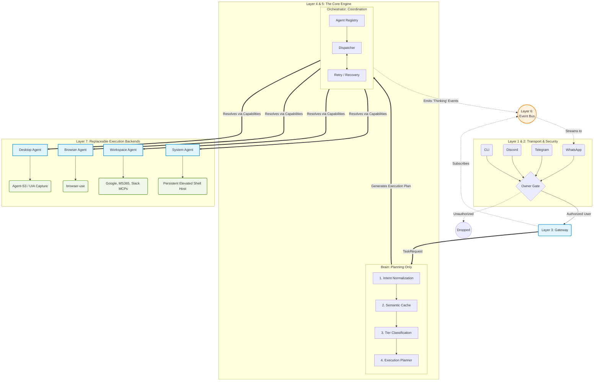

# Dex

A calm cockpit for commanding agents you can trust.

Dex is a Windows-first, chat-first control surface for a local AI agent that has *hands* on your machine — it can drive real Windows app GUIs (Office, browsers, settings panels, anything with a UI Automation tree), not just shell commands.

> **v1 is desktop Windows only.** Mobile, macOS, and Linux are in the roadmap but not built. See `prompt.md` §9 for the scope boundary.

---

## Architecture

```
Flutter app (Dex)
   │  HTTP + WebSocket on 127.0.0.1:18789
   ▼
Dex gateway (Node 24)                       ← the brain · Anthropic Claude
   │  MCP stdio (picks per-turn based on SKILL.md descriptions)
   ▼
   ┌───────────────────────────┬─────────────────────────────┐
   ▼                           ▼                             ▼
Dex built-in            windows-desktop-              browser-control
shell / file / process  control MCP (UFO²)            MCP (browser-use)
                        Python 3.10/3.11              Python 3.11
                        Win32 UIA, Groq Qwen 3        Playwright + Groq Qwen 3
                        run_desktop_task              run_browser_task
```

- **Dex core** (`dex/core/`) — sessions, channels, skills, memory, cron, built-in shell tools. Forked from OpenClaw at commit `7074cf8e23c1f64362c4f8c4bf32971ca94d5221` (see `dex/core/HERITAGE.md`).
- **UFO²** (`vendor/UFO/`) — Windows native-app GUI automation via the accessibility tree.
- **browser-use** (`vendor/browser-use/`) — browser automation via Playwright + an LLM-driven agent.
- **windows-desktop-control** (`dex/drivers/windows-desktop-control/`) — MCP server exposing `run_desktop_task` to Claude.
- **browser-control** (`dex/drivers/browser-control/`) — MCP server exposing `run_browser_task` to Claude.
- **app/** — the Flutter client. Talks to the Dex gateway. Implements `design.md`; renders Gemini-style tool chips so the user sees which tool Claude picked.

---

## Quick start

> See [`PLAN.md`](./PLAN.md) for the full phased build plan and current progress.

```powershell
# 1. one-time prereq check
.\scripts\setup-windows.ps1

# 2. when all phases are done
.\scripts\run-dev.ps1   # starts gateway + MCP server + Flutter app
```

Requirements:
- Windows 10 / 11
- Node 24 (or Node 22.19+)
- Python 3.10
- Flutter SDK with Windows desktop target enabled
- Anthropic API key (OpenClaw)
- Groq API key (UFO² default — Qwen 3, free)

---

## Repo layout

```
D:\project1\
├── README.md                  this file
├── PLAN.md                    live progress tracker — read this first when resuming
├── LICENSES.md                third-party license audit
├── SECURITY.md                risk surface + isolation
├── design.md                  UI/UX spec — single source of design truth
├── prompt.md                  build contract — assistant rules of engagement
├── dex/                       Dex framework (Phase B.9+)
│   ├── core/                  forked OpenClaw runtime + dex binary
│   │   ├── HERITAGE.md        origin commit + MIT credit
│   │   ├── package.json       "name": "dexagent", "bin": { "dex": ... }
│   │   ├── src/               TS source (post-rebrand: Dex / DEX_*)
│   │   └── packages/          @dexagent/* workspace packages
│   └── drivers/               MCP driver servers (Python 3.10/3.11)
│       ├── windows-desktop-control/  FastMCP wrapper around UFO²
│       └── browser-control/   FastMCP wrapper around browser-use
├── vendor/
│   ├── UFO/                   pinned commit, do not modify
│   └── browser-use/           pinned commit, do not modify
├── docs/migration/            B.1 audit + B.11 migration report
├── app/                       Flutter desktop client (com.chethan616.dex)
└── scripts/                   PowerShell helpers (rebrand / audit / run-dev)
```

---

## Pinned vendor commits

Recorded so builds are reproducible. Update only when intentionally bumping.

| Vendor | Commit | Date pinned |
|---|---|---|
| `core/` (Dex brain — fork of `openclaw/openclaw`) | `7074cf8e23c1f64362c4f8c4bf32971ca94d5221` | 2026-06-03 — see `core/HERITAGE.md` |
| `microsoft/UFO`            | `adef15b8789b015356977ed742916de2da644509` | 2026-05-26 |
| `browser-use/browser-use`  | `4931a7e0217cf9c64450348b96511733263c9268` | 2026-06-01 |

---

## Workflow



---

## License

Dex source in this repo is MIT. See `LICENSES.md` for the full third-party audit (vendored repos, Flutter deps, fonts). No AGPL components are bundled with the shipped product.
