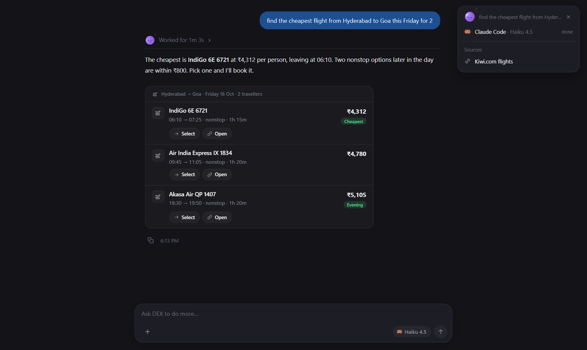
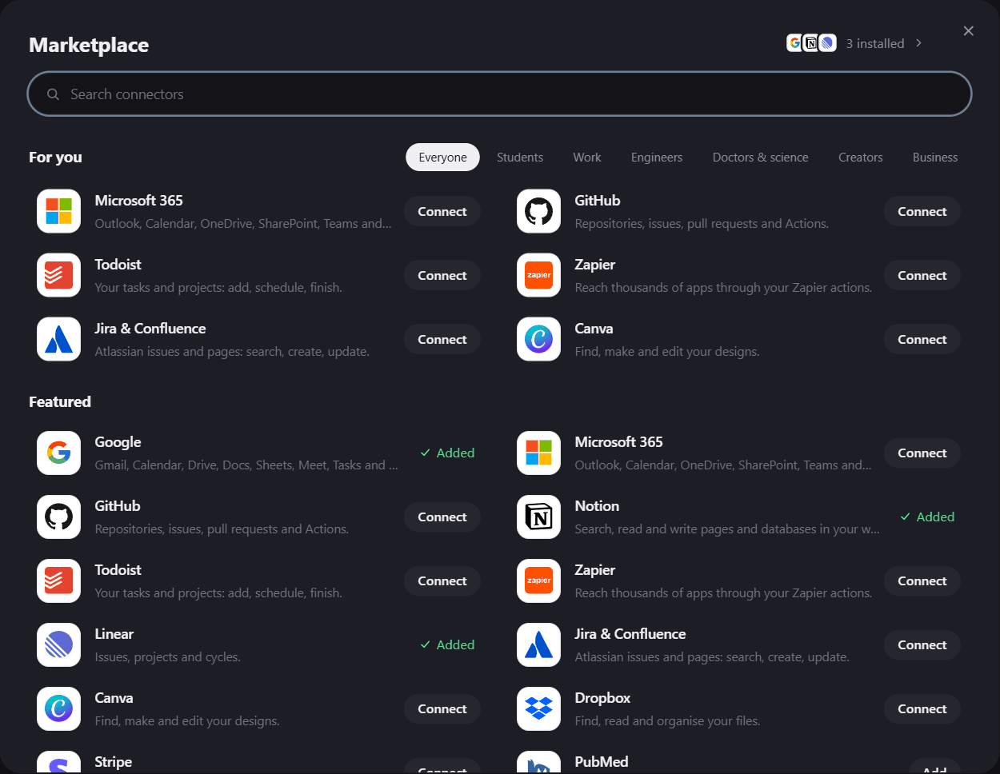
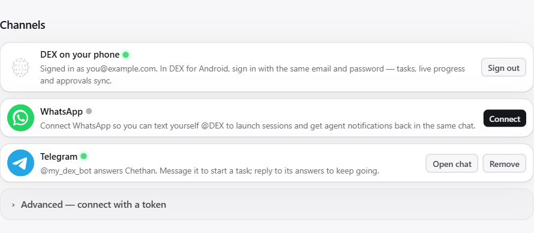

# DEX

[](LICENSE)
[](https://github.com/Chethan616/Dex/releases/latest)
[](https://github.com/Chethan616/Dex/stargazers)
[](CONTRIBUTING.md)
[](https://github.com/Chethan616/Dex/labels/good%20first%20issue)

**An open-source AI agent that does real work on your Windows PC — in your browser, your files, your apps and your accounts — while you keep using it. Hand it tasks from your desk, your phone, WhatsApp or Telegram.**



Tell DEX what you want in plain words:

> *"Find the cheapest flight from Hyderabad to Goa this Friday for 2."*
> *"Reply to the mail from my landlord and put the inspection in my calendar."*
> *"My Wi-Fi keeps dropping. Find out why and fix it."*
> *"Turn this PDF into a one-page summary and send it to my phone."*

DEX plans it, does it on your PC, shows you every step live, and asks before
anything risky. Answers come back as things you can act on — flight cards with
**Select** and **Open**, a date picker when it needs a date — not walls of text.

**[⬇ Download for Windows](https://github.com/Chethan616/Dex/releases/latest)** · **[Android app](https://github.com/Chethan616/Dex/releases/latest)** · free and open source (Apache-2.0)

## What DEX can do

- **Use the web like you do.** Each task gets its own workspace: real browser
  tabs that you and DEX share (you can click around while it works), the
  documents it makes, and a chat. A small *DEX* cursor shows where it clicks.
- **Work your accounts properly.** 50+ connectors — Google (Gmail, Calendar,
  Drive, Docs, Sheets, Meet), GitHub, Notion, Jira, Linear,
  Slack, Canva, Dropbox, Stripe, PubMed and more — each one a single sign-in in
  your browser. DEX uses the service's API instead of clicking through its
  website: faster, cheaper and it doesn't break when a page changes.
- **Travel without the tab chaos.** Flights come from Kiwi.com and hotels from
  trivago, straight into cards you can tap — no sign-in, nothing to set up.
- **Drive Windows itself.** DEX works your apps and settings in the
  background without taking your mouse: play music, check what's wrong with
  the Wi-Fi, fix it (with undo). If it ever has to borrow your mouse, it lets
  go the moment you move.
- **Make and open files.** PDFs, Word, Excel, CSV, Markdown, code, images,
  video and 3D models open right inside the task, and reload as DEX edits them.
  It can even build 3D scenes in Blender.
- **Reach it from anywhere.**
  - **Phone app (Android):** start tasks, follow them live in a status-bar
    live update, approve steps and open the files it made.
  - **WhatsApp:** text yourself `@DEX book a table for 4 tonight`.
  - **Telegram:** your own private DEX bot, set up in a minute.

## Why DEX

- **It runs on your PC,** with your logins and your files. There's no cloud
  browser and no one else's computer in the middle.
- **Bring your own brain.** Sign in to **Claude Code** or **Codex** with the plan
  you already have, or use **BrowserCode** with your own key for Kimi, Qwen
  or MiniMax.
- **You stay in control.** Choose how much it may do on its own: *Ask for
  approval*, *Approve for me* (routine steps run, risky ones ask) or *Full
  access*. Password fields are masked from the agent, tokens live in the
  Windows Credential Manager, and it never touches your password manager,
  Windows Security or terminals. See [SECURITY.md](SECURITY.md).
- **Open source,** under Apache-2.0. Read it, change it, ship it.

## Get started

1. **Download [`dex-setup.exe`](https://github.com/Chethan616/Dex/releases/latest)** and run it (Windows 10 or 11).
   It isn't code-signed yet, so SmartScreen may say *"Windows protected your PC"*: click **More info → Run anyway**.
2. **Setup installs what DEX needs** (Git, Node.js, Bun; Blender if you want 3D). Nothing to type.
3. **Pick an engine:** sign in to Claude Code or Codex (DEX installs either with one click), or paste an API key.
4. **Optional — the phone:** install the APK from the same page on Android 8+, and sign in with the same email and password as on your PC.

Then type a task. A good first one: *"What's on my calendar this week? Find a free hour for a gym session and book it."*

<p align="center">
  
  
</p>

## Help build it

DEX is young and moving fast, and there's a lot of room to make your mark:

- **New connectors and travel/food sources** (restaurants, trains, buses).
- **macOS and Linux** ports — the agent core is cross-platform; the Windows
  control and installer aren't.
- **An iPhone app** to match the Android one.
- **Translations,** accessibility, and tests.

Start with an issue labelled
[good first issue](https://github.com/Chethan616/Dex/labels/good%20first%20issue)
or [help wanted](https://github.com/Chethan616/Dex/labels/help%20wanted), ask in
[Discussions](https://github.com/Chethan616/Dex/discussions), and read
[CONTRIBUTING.md](CONTRIBUTING.md). Found a bug? A clear
[issue](https://github.com/Chethan616/Dex/issues/new/choose) with steps and a
screenshot is one of the most useful things you can give.

If DEX saves you time, **a ⭐ helps more people find it.**

---

## Repository

```
desktop/app/          the Windows app (Electron + React + TypeScript)
  src/main/           main process: sessions, the shared browser (BrowserPool),
                      the agent's CDP broker, approvals, connectors, phone bridge
  src/renderer/hub/   the UI: dashboard, task workspace, chat, settings
  src/shared/         types and logic both sides use
  mcp-servers/        DEX's built-in MCP servers (Google, Microsoft, Reddit,
                      Blender, Windows)
  tests/              vitest unit tests
android/              the phone app (Kotlin, Jetpack Compose, Material 3 Expressive)
firebase/             Firestore rules and the setup script for your own project
docs/                 plans and research (docs/unify, docs/desktop-control)
TO_BE_DONE.md         the hand-over: state, rules, and what's next
```

## Building

**Desktop** (Windows, Node 22+, yarn):

```powershell
cd desktop\app
yarn install
yarn start          # dev build
npx vitest run      # tests
```

**Phone** (JDK 17+, Android SDK):

```powershell
cd android
.\gradlew :app:assembleDebug
```

Pairing the phone needs your own Firebase project: see `firebase/README.md`.
Release steps are in `TO_BE_DONE.md`.

## Contributing

Pull requests, issues and ideas are welcome — from a typo fix to a new
connector. [CONTRIBUTING.md](CONTRIBUTING.md) has the setup, the checks to run
and how reviews work. Be kind: [CODE_OF_CONDUCT.md](CODE_OF_CONDUCT.md).
Security issues go to [SECURITY.md](SECURITY.md), not a public issue.

## License

DEX is licensed under the **[Apache License 2.0](LICENSE)** — free to use,
change and ship, commercially too.

**Credit is required.** DEX was created by Chethan Krishna
([@Chethan616](https://github.com/Chethan616)). If you redistribute DEX or
build something from it, keep the attribution in [NOTICE](NOTICE) — in your
NOTICE file, docs or About screen — and mark the files you changed
(Apache-2.0 §4).

Third-party components and their licenses are in [LICENSES.md](LICENSES.md).
Code published before 7 October 2026 (before v1.0.0) was MIT.
